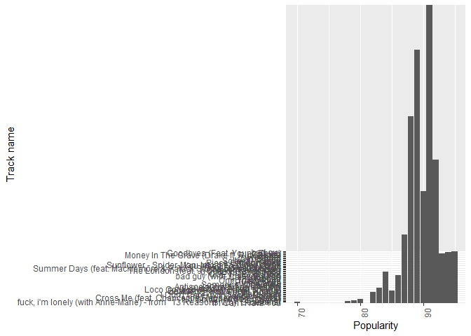
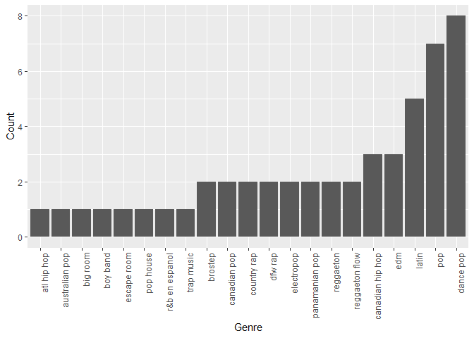

<!DOCTYPE html PUBLIC "-//W3C//DTD XHTML 1.0 Transitional//EN" "http://www.w3.org/TR/xhtml1/DTD/xhtml1-transitional.dtd">
<html xmlns="http://www.w3.org/1999/xhtml">
<head>
  <meta http-equiv="Content-Type" content="text/html; charset=utf-8" />
  <meta http-equiv="Content-Style-Type" content="text/css" />
  <meta name="generator" content="pandoc" />
  <title>index1.utf8</title>
  
  
</head>
<body>
<h2 id="top-50-tracks-in-2019">Top 50 Tracks in 2019</h2>

An analysis of the top 50 tracks on Spotify with R. <strong>What a way to say goodbye to 2019!</strong> You can find the dataset on Kaggle, <a href="https://www.kaggle.com/leonardopena/top50spotify2019" class="uri">https://www.kaggle.com/leonardopena/top50spotify2019</a>.

<h3 id="lets-take-a-look-at-the-dataset">Let’s take a look at the dataset:</h3>

<pre class="sourceCode r"><code class="sourceCode r"><a class="sourceLine" id="cb1-1" title="1">summary(top50)</a></code></pre>

<pre><code>##        X                                   Track.Name        Artist.Name
##  Min.   : 1.00   0.958333333333333              : 1   Ed Sheeran   : 4  
##  1st Qu.:13.25   7 rings                        : 1   Ariana Grande: 2  
##  Median :25.50   Antisocial (with Travis Scott) : 1   Billie Eilish: 2  
##  Mean   :25.50   bad guy                        : 1   J Balvin     : 2  
##  3rd Qu.:37.75   bad guy (with Justin Bieber)   : 1   Lil Nas X    : 2  
##  Max.   :50.00   Beautiful People (feat. Khalid): 1   Marshmello   : 2  
##                  (Other)                        :44   (Other)      :36  
##               Genre    Beats.Per.Minute     Energy       Danceability  
##  dance pop       : 8   Min.   : 85.0    Min.   :32.00   Min.   :29.00  
##  pop             : 7   1st Qu.: 96.0    1st Qu.:55.25   1st Qu.:67.00  
##  latin           : 5   Median :104.5    Median :66.50   Median :73.50  
##  canadian hip hop: 3   Mean   :120.1    Mean   :64.06   Mean   :71.38  
##  edm             : 3   3rd Qu.:137.5    3rd Qu.:74.75   3rd Qu.:79.75  
##  brostep         : 2   Max.   :190.0    Max.   :88.00   Max.   :90.00  
##  (Other)         :22                                                   
##  Loudness..dB..      Liveness        Valence.        Length.     
##  Min.   :-11.00   Min.   : 5.00   Min.   :10.00   Min.   :115.0  
##  1st Qu.: -6.75   1st Qu.: 8.00   1st Qu.:38.25   1st Qu.:176.8  
##  Median : -6.00   Median :11.00   Median :55.50   Median :198.0  
##  Mean   : -5.66   Mean   :14.66   Mean   :54.60   Mean   :201.0  
##  3rd Qu.: -4.00   3rd Qu.:15.75   3rd Qu.:69.50   3rd Qu.:217.5  
##  Max.   : -2.00   Max.   :58.00   Max.   :95.00   Max.   :309.0  
##                                                                  
##  Acousticness..   Speechiness.     Popularity   
##  Min.   : 1.00   Min.   : 3.00   Min.   :70.00  
##  1st Qu.: 8.25   1st Qu.: 5.00   1st Qu.:86.00  
##  Median :15.00   Median : 7.00   Median :88.00  
##  Mean   :22.16   Mean   :12.48   Mean   :87.50  
##  3rd Qu.:33.75   3rd Qu.:15.00   3rd Qu.:90.75  
##  Max.   :75.00   Max.   :46.00   Max.   :95.00  
## </code></pre>

<pre class="sourceCode r"><code class="sourceCode r"><a class="sourceLine" id="cb3-1" title="1"># Plotting by popularity</a>
<a class="sourceLine" id="cb3-2" title="2">top50$Track.Name&lt;-factor(top50$Track.Name,levels=top50$Track.Name[order(top50$Popularity)])</a>

<a class="sourceLine" id="cb3-4" title="4">ggplot(top50,aes(y=top50$Track.Name,x=top50$Popularity)) + </a>
<a class="sourceLine" id="cb3-5" title="5">  xlab(&quot;Popularity&quot;) + </a>
<a class="sourceLine" id="cb3-6" title="6">  ylab(&quot;Track name&quot;) + </a>
<a class="sourceLine" id="cb3-7" title="7">  geom_bar(stat=&quot;identity&quot;) +</a>
<a class="sourceLine" id="cb3-8" title="8">  theme(axis.text.x=element_text(angle=90,hjust=1))</a></code></pre>

<!-- -->

<h3 id="what-about-the-music-genre">What About the Music Genre?</h3>

<pre class="sourceCode r"><code class="sourceCode r"><a class="sourceLine" id="cb4-1" title="1"># Plotting Genre Count</a>

<a class="sourceLine" id="cb4-3" title="3">genre_count$Genre&lt;-factor(genre_count$Genre,levels=genre_count$Genre[order(genre_count$count)])</a>

<a class="sourceLine" id="cb4-5" title="5">ggplot(genre_count,aes(x=genre_count$Genre,y=genre_count$count)) + </a>
<a class="sourceLine" id="cb4-6" title="6">  xlab(&quot;Genre&quot;) + </a>
<a class="sourceLine" id="cb4-7" title="7">  ylab(&quot;Count&quot;) + </a>
<a class="sourceLine" id="cb4-8" title="8">  geom_bar(stat=&quot;identity&quot;) +</a>
<a class="sourceLine" id="cb4-9" title="9">  theme(axis.text.x=element_text(angle=90,hjust=1))</a></code></pre>

<!-- -->

<h3 id="artists-by-number-of-songs-in-the-top-50-list">Artists by Number of Songs in the Top 50 List</h3>

<pre class="sourceCode r"><code class="sourceCode r"><a class="sourceLine" id="cb5-1" title="1">knitr::kable(artist_count, col.names = c(&quot;Artist&quot;,&quot;Count&quot;)) %&gt;% kable_styling() %&gt;% scroll_box(width=&quot;50%&quot;,height=&quot;200px&quot;)</a></code></pre>

<table class="table" style="margin-left: auto; margin-right: auto;">
<thead>
<tr>
<th style="text-align:left;position: sticky; top:0; background-color: #FFFFFF;">
Artist
</th>
<th style="text-align:right;position: sticky; top:0; background-color: #FFFFFF;">
Count
</th>
</tr>
</thead>
<tbody>
<tr>
<td style="text-align:left;">
Ed Sheeran
</td>
<td style="text-align:right;">
4
</td>
</tr>
<tr>
<td style="text-align:left;">
Ariana Grande
</td>
<td style="text-align:right;">
2
</td>
</tr>
<tr>
<td style="text-align:left;">
Billie Eilish
</td>
<td style="text-align:right;">
2
</td>
</tr>
<tr>
<td style="text-align:left;">
J Balvin
</td>
<td style="text-align:right;">
2
</td>
</tr>
<tr>
<td style="text-align:left;">
Lil Nas X
</td>
<td style="text-align:right;">
2
</td>
</tr>
<tr>
<td style="text-align:left;">
Marshmello
</td>
<td style="text-align:right;">
2
</td>
</tr>
<tr>
<td style="text-align:left;">
Post Malone
</td>
<td style="text-align:right;">
2
</td>
</tr>
<tr>
<td style="text-align:left;">
Sech
</td>
<td style="text-align:right;">
2
</td>
</tr>
<tr>
<td style="text-align:left;">
Shawn Mendes
</td>
<td style="text-align:right;">
2
</td>
</tr>
<tr>
<td style="text-align:left;">
The Chainsmokers
</td>
<td style="text-align:right;">
2
</td>
</tr>
<tr>
<td style="text-align:left;">
Ali Gatie
</td>
<td style="text-align:right;">
1
</td>
</tr>
<tr>
<td style="text-align:left;">
Anuel AA
</td>
<td style="text-align:right;">
1
</td>
</tr>
<tr>
<td style="text-align:left;">
Bad Bunny
</td>
<td style="text-align:right;">
1
</td>
</tr>
<tr>
<td style="text-align:left;">
Chris Brown
</td>
<td style="text-align:right;">
1
</td>
</tr>
<tr>
<td style="text-align:left;">
Daddy Yankee
</td>
<td style="text-align:right;">
1
</td>
</tr>
<tr>
<td style="text-align:left;">
DJ Snake
</td>
<td style="text-align:right;">
1
</td>
</tr>
<tr>
<td style="text-align:left;">
Drake
</td>
<td style="text-align:right;">
1
</td>
</tr>
<tr>
<td style="text-align:left;">
Jhay Cortez
</td>
<td style="text-align:right;">
1
</td>
</tr>
<tr>
<td style="text-align:left;">
Jonas Brothers
</td>
<td style="text-align:right;">
1
</td>
</tr>
<tr>
<td style="text-align:left;">
Katy Perry
</td>
<td style="text-align:right;">
1
</td>
</tr>
<tr>
<td style="text-align:left;">
Khalid
</td>
<td style="text-align:right;">
1
</td>
</tr>
<tr>
<td style="text-align:left;">
Kygo
</td>
<td style="text-align:right;">
1
</td>
</tr>
<tr>
<td style="text-align:left;">
Lady Gaga
</td>
<td style="text-align:right;">
1
</td>
</tr>
<tr>
<td style="text-align:left;">
Lauv
</td>
<td style="text-align:right;">
1
</td>
</tr>
<tr>
<td style="text-align:left;">
Lewis Capaldi
</td>
<td style="text-align:right;">
1
</td>
</tr>
<tr>
<td style="text-align:left;">
Lil Tecca
</td>
<td style="text-align:right;">
1
</td>
</tr>
<tr>
<td style="text-align:left;">
Lizzo
</td>
<td style="text-align:right;">
1
</td>
</tr>
<tr>
<td style="text-align:left;">
Lunay
</td>
<td style="text-align:right;">
1
</td>
</tr>
<tr>
<td style="text-align:left;">
Maluma
</td>
<td style="text-align:right;">
1
</td>
</tr>
<tr>
<td style="text-align:left;">
Martin Garrix
</td>
<td style="text-align:right;">
1
</td>
</tr>
<tr>
<td style="text-align:left;">
MEDUZA
</td>
<td style="text-align:right;">
1
</td>
</tr>
<tr>
<td style="text-align:left;">
Nicky Jam
</td>
<td style="text-align:right;">
1
</td>
</tr>
<tr>
<td style="text-align:left;">
ROSALΝA
</td>
<td style="text-align:right;">
1
</td>
</tr>
<tr>
<td style="text-align:left;">
Sam Smith
</td>
<td style="text-align:right;">
1
</td>
</tr>
<tr>
<td style="text-align:left;">
Taylor Swift
</td>
<td style="text-align:right;">
1
</td>
</tr>
<tr>
<td style="text-align:left;">
Tones and I
</td>
<td style="text-align:right;">
1
</td>
</tr>
<tr>
<td style="text-align:left;">
Y2K
</td>
<td style="text-align:right;">
1
</td>
</tr>
<tr>
<td style="text-align:left;">
Young Thug
</td>
<td style="text-align:right;">
1
</td>
</tr>
</tbody>
</table>

<h3 id="artists-by-popularity-of-songs">Artists by Popularity of Songs</h3>

<pre class="sourceCode r"><code class="sourceCode r"><a class="sourceLine" id="cb6-1" title="1">artist_pop &lt;-top50 %&gt;% select(Artist.Name,Popularity)</a>
<a class="sourceLine" id="cb6-2" title="2">artist_pop &lt;-artist_pop %&gt;% group_by(Artist.Name) %&gt;% summarise(average_pop=mean(Popularity)) %&gt;% arrange(desc(average_pop))</a>

<a class="sourceLine" id="cb6-4" title="4">knitr::kable(artist_pop, col.names = c(&quot;Artist&quot;,&quot;Average Popularity&quot;)) %&gt;% kable_styling() %&gt;% scroll_box(width=&quot;50%&quot;,height=&quot;200px&quot;)</a></code></pre>

<table class="table" style="margin-left: auto; margin-right: auto;">
<thead>
<tr>
<th style="text-align:left;position: sticky; top:0; background-color: #FFFFFF;">
Artist
</th>
<th style="text-align:right;position: sticky; top:0; background-color: #FFFFFF;">
Average Popularity
</th>
</tr>
</thead>
<tbody>
<tr>
<td style="text-align:left;">
Bad Bunny
</td>
<td style="text-align:right;">
93.00
</td>
</tr>
<tr>
<td style="text-align:left;">
Post Malone
</td>
<td style="text-align:right;">
92.50
</td>
</tr>
<tr>
<td style="text-align:left;">
Anuel AA
</td>
<td style="text-align:right;">
92.00
</td>
</tr>
<tr>
<td style="text-align:left;">
Billie Eilish
</td>
<td style="text-align:right;">
92.00
</td>
</tr>
<tr>
<td style="text-align:left;">
Drake
</td>
<td style="text-align:right;">
92.00
</td>
</tr>
<tr>
<td style="text-align:left;">
Lil Tecca
</td>
<td style="text-align:right;">
92.00
</td>
</tr>
<tr>
<td style="text-align:left;">
Daddy Yankee
</td>
<td style="text-align:right;">
91.00
</td>
</tr>
<tr>
<td style="text-align:left;">
Lizzo
</td>
<td style="text-align:right;">
91.00
</td>
</tr>
<tr>
<td style="text-align:left;">
Lunay
</td>
<td style="text-align:right;">
91.00
</td>
</tr>
<tr>
<td style="text-align:left;">
MEDUZA
</td>
<td style="text-align:right;">
91.00
</td>
</tr>
<tr>
<td style="text-align:left;">
Sam Smith
</td>
<td style="text-align:right;">
90.00
</td>
</tr>
<tr>
<td style="text-align:left;">
Taylor Swift
</td>
<td style="text-align:right;">
90.00
</td>
</tr>
<tr>
<td style="text-align:left;">
J Balvin
</td>
<td style="text-align:right;">
89.50
</td>
</tr>
<tr>
<td style="text-align:left;">
Ali Gatie
</td>
<td style="text-align:right;">
89.00
</td>
</tr>
<tr>
<td style="text-align:left;">
Katy Perry
</td>
<td style="text-align:right;">
89.00
</td>
</tr>
<tr>
<td style="text-align:left;">
Lil Nas X
</td>
<td style="text-align:right;">
89.00
</td>
</tr>
<tr>
<td style="text-align:left;">
Maluma
</td>
<td style="text-align:right;">
89.00
</td>
</tr>
<tr>
<td style="text-align:left;">
Martin Garrix
</td>
<td style="text-align:right;">
89.00
</td>
</tr>
<tr>
<td style="text-align:left;">
Sech
</td>
<td style="text-align:right;">
89.00
</td>
</tr>
<tr>
<td style="text-align:left;">
Young Thug
</td>
<td style="text-align:right;">
89.00
</td>
</tr>
<tr>
<td style="text-align:left;">
Kygo
</td>
<td style="text-align:right;">
88.00
</td>
</tr>
<tr>
<td style="text-align:left;">
Lewis Capaldi
</td>
<td style="text-align:right;">
88.00
</td>
</tr>
<tr>
<td style="text-align:left;">
Marshmello
</td>
<td style="text-align:right;">
88.00
</td>
</tr>
<tr>
<td style="text-align:left;">
Nicky Jam
</td>
<td style="text-align:right;">
88.00
</td>
</tr>
<tr>
<td style="text-align:left;">
ROSALΝA
</td>
<td style="text-align:right;">
88.00
</td>
</tr>
<tr>
<td style="text-align:left;">
Y2K
</td>
<td style="text-align:right;">
88.00
</td>
</tr>
<tr>
<td style="text-align:left;">
Ariana Grande
</td>
<td style="text-align:right;">
87.00
</td>
</tr>
<tr>
<td style="text-align:left;">
Lady Gaga
</td>
<td style="text-align:right;">
87.00
</td>
</tr>
<tr>
<td style="text-align:left;">
DJ Snake
</td>
<td style="text-align:right;">
86.00
</td>
</tr>
<tr>
<td style="text-align:left;">
The Chainsmokers
</td>
<td style="text-align:right;">
86.00
</td>
</tr>
<tr>
<td style="text-align:left;">
Ed Sheeran
</td>
<td style="text-align:right;">
84.75
</td>
</tr>
<tr>
<td style="text-align:left;">
Khalid
</td>
<td style="text-align:right;">
84.00
</td>
</tr>
<tr>
<td style="text-align:left;">
Jhay Cortez
</td>
<td style="text-align:right;">
83.00
</td>
</tr>
<tr>
<td style="text-align:left;">
Tones and I
</td>
<td style="text-align:right;">
83.00
</td>
</tr>
<tr>
<td style="text-align:left;">
Chris Brown
</td>
<td style="text-align:right;">
82.00
</td>
</tr>
<tr>
<td style="text-align:left;">
Jonas Brothers
</td>
<td style="text-align:right;">
80.00
</td>
</tr>
<tr>
<td style="text-align:left;">
Lauv
</td>
<td style="text-align:right;">
78.00
</td>
</tr>
<tr>
<td style="text-align:left;">
Shawn Mendes
</td>
<td style="text-align:right;">
74.50
</td>
</tr>
</tbody>
</table>

<h3 id="artists-energy">Artists’ Energy</h3>

<pre class="sourceCode r"><code class="sourceCode r"><a class="sourceLine" id="cb7-1" title="1">artist_energy&lt;-top50 %&gt;% select(Artist.Name,Energy)</a>
<a class="sourceLine" id="cb7-2" title="2">artist_energy&lt;-artist_energy %&gt;% group_by(Artist.Name) %&gt;% summarise(average_energy=mean(Energy)) %&gt;% arrange(desc(average_energy))</a>

<a class="sourceLine" id="cb7-4" title="4">knitr::kable(artist_energy, col.names = c(&quot;Artist&quot;,&quot;Average Energy&quot;)) %&gt;% kable_styling() %&gt;% scroll_box(width=&quot;50%&quot;,height=&quot;200px&quot;)</a></code></pre>

<table class="table" style="margin-left: auto; margin-right: auto;">
<thead>
<tr>
<th style="text-align:left;position: sticky; top:0; background-color: #FFFFFF;">
Artist
</th>
<th style="text-align:right;position: sticky; top:0; background-color: #FFFFFF;">
Average Energy
</th>
</tr>
</thead>
<tbody>
<tr>
<td style="text-align:left;">
Katy Perry
</td>
<td style="text-align:right;">
88.0
</td>
</tr>
<tr>
<td style="text-align:left;">
Daddy Yankee
</td>
<td style="text-align:right;">
86.0
</td>
</tr>
<tr>
<td style="text-align:left;">
Anuel AA
</td>
<td style="text-align:right;">
81.0
</td>
</tr>
<tr>
<td style="text-align:left;">
Jhay Cortez
</td>
<td style="text-align:right;">
79.0
</td>
</tr>
<tr>
<td style="text-align:left;">
Lunay
</td>
<td style="text-align:right;">
78.0
</td>
</tr>
<tr>
<td style="text-align:left;">
Nicky Jam
</td>
<td style="text-align:right;">
75.0
</td>
</tr>
<tr>
<td style="text-align:left;">
Sech
</td>
<td style="text-align:right;">
74.5
</td>
</tr>
<tr>
<td style="text-align:left;">
MEDUZA
</td>
<td style="text-align:right;">
74.0
</td>
</tr>
<tr>
<td style="text-align:left;">
Ed Sheeran
</td>
<td style="text-align:right;">
73.5
</td>
</tr>
<tr>
<td style="text-align:left;">
Jonas Brothers
</td>
<td style="text-align:right;">
73.0
</td>
</tr>
<tr>
<td style="text-align:left;">
J Balvin
</td>
<td style="text-align:right;">
72.0
</td>
</tr>
<tr>
<td style="text-align:left;">
Martin Garrix
</td>
<td style="text-align:right;">
72.0
</td>
</tr>
<tr>
<td style="text-align:left;">
DJ Snake
</td>
<td style="text-align:right;">
71.0
</td>
</tr>
<tr>
<td style="text-align:left;">
Maluma
</td>
<td style="text-align:right;">
71.0
</td>
</tr>
<tr>
<td style="text-align:left;">
Marshmello
</td>
<td style="text-align:right;">
70.5
</td>
</tr>
<tr>
<td style="text-align:left;">
ROSALΝA
</td>
<td style="text-align:right;">
69.0
</td>
</tr>
<tr>
<td style="text-align:left;">
Shawn Mendes
</td>
<td style="text-align:right;">
68.5
</td>
</tr>
<tr>
<td style="text-align:left;">
Kygo
</td>
<td style="text-align:right;">
68.0
</td>
</tr>
<tr>
<td style="text-align:left;">
Sam Smith
</td>
<td style="text-align:right;">
68.0
</td>
</tr>
<tr>
<td style="text-align:left;">
Taylor Swift
</td>
<td style="text-align:right;">
68.0
</td>
</tr>
<tr>
<td style="text-align:left;">
Lil Tecca
</td>
<td style="text-align:right;">
64.0
</td>
</tr>
<tr>
<td style="text-align:left;">
Bad Bunny
</td>
<td style="text-align:right;">
62.0
</td>
</tr>
<tr>
<td style="text-align:left;">
Lizzo
</td>
<td style="text-align:right;">
62.0
</td>
</tr>
<tr>
<td style="text-align:left;">
Lil Nas X
</td>
<td style="text-align:right;">
60.5
</td>
</tr>
<tr>
<td style="text-align:left;">
The Chainsmokers
</td>
<td style="text-align:right;">
60.5
</td>
</tr>
<tr>
<td style="text-align:left;">
Tones and I
</td>
<td style="text-align:right;">
59.0
</td>
</tr>
<tr>
<td style="text-align:left;">
Young Thug
</td>
<td style="text-align:right;">
59.0
</td>
</tr>
<tr>
<td style="text-align:left;">
Post Malone
</td>
<td style="text-align:right;">
56.5
</td>
</tr>
<tr>
<td style="text-align:left;">
Ariana Grande
</td>
<td style="text-align:right;">
56.0
</td>
</tr>
<tr>
<td style="text-align:left;">
Lauv
</td>
<td style="text-align:right;">
56.0
</td>
</tr>
<tr>
<td style="text-align:left;">
Drake
</td>
<td style="text-align:right;">
50.0
</td>
</tr>
<tr>
<td style="text-align:left;">
Ali Gatie
</td>
<td style="text-align:right;">
46.0
</td>
</tr>
<tr>
<td style="text-align:left;">
Chris Brown
</td>
<td style="text-align:right;">
45.0
</td>
</tr>
<tr>
<td style="text-align:left;">
Billie Eilish
</td>
<td style="text-align:right;">
44.0
</td>
</tr>
<tr>
<td style="text-align:left;">
Lewis Capaldi
</td>
<td style="text-align:right;">
41.0
</td>
</tr>
<tr>
<td style="text-align:left;">
Khalid
</td>
<td style="text-align:right;">
40.0
</td>
</tr>
<tr>
<td style="text-align:left;">
Lady Gaga
</td>
<td style="text-align:right;">
39.0
</td>
</tr>
<tr>
<td style="text-align:left;">
Y2K
</td>
<td style="text-align:right;">
39.0
</td>
</tr>
</tbody>
</table>

<h3 id="which-are-the-factors-contributing-to-popularity">Which Are the Factors Contributing to Popularity?</h3>
<h4 id="to-be-continued">(to be continued)</h4>

</body>
</html>
